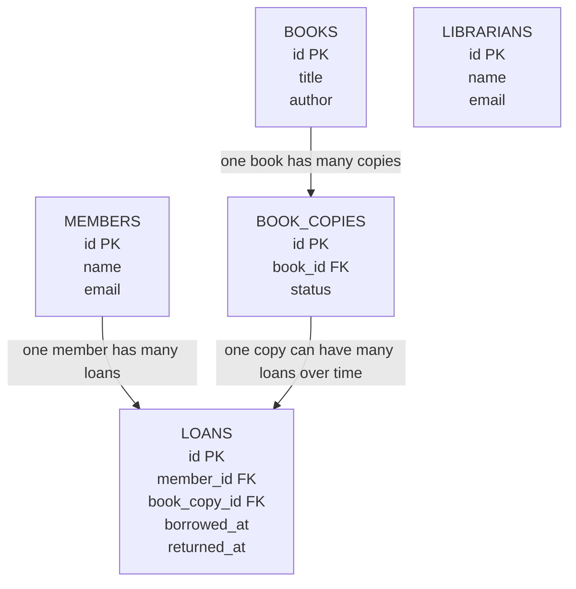

# Library Management System - Database Relationships

## Relationship Notes

- `book_copies.book_id` references `books.id`.
- `loans.member_id` references `members.id`.
- `loans.book_copy_id` references `book_copies.id`.
- Librarians are stored separately because this version does not track which librarian handled each loan.