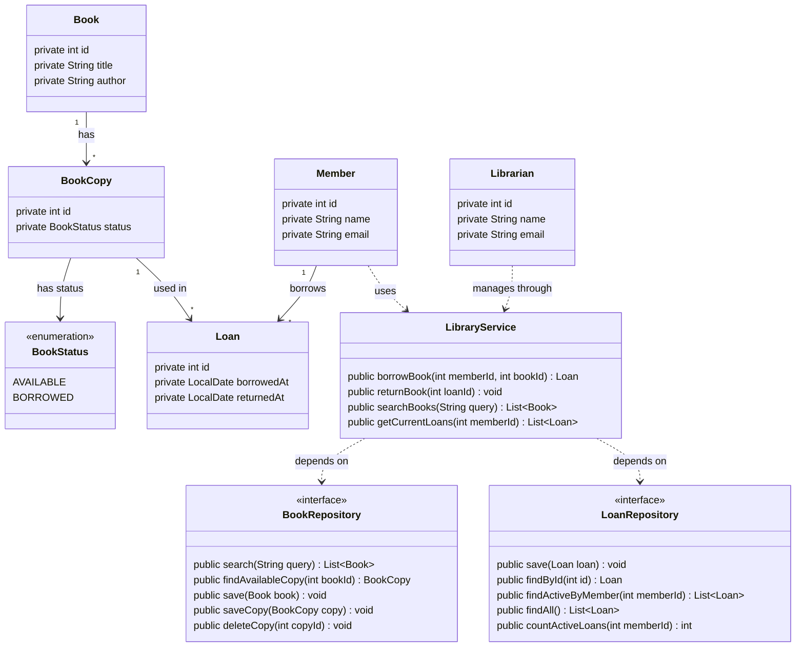
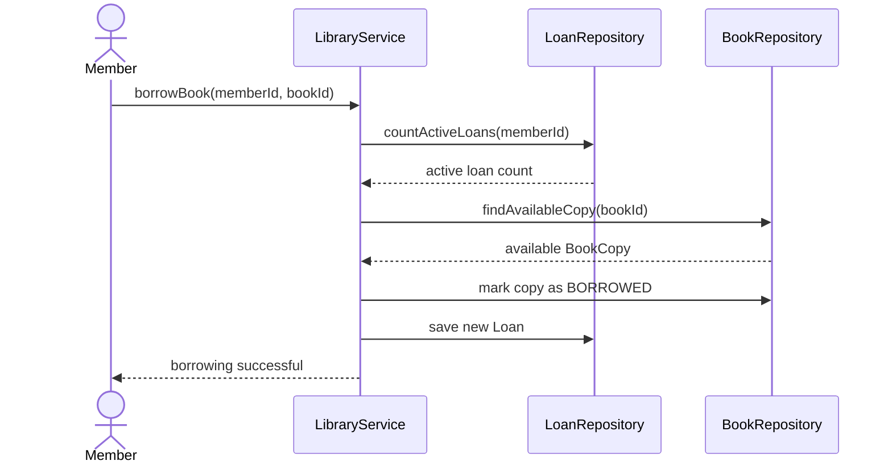

# Library Management System - Diagrams

## UML Class Diagram

## Why I Used Repository Interfaces

I used `BookRepository` and `LoanRepository` so that the main library logic does not need to know how the data is actually stored.

For example, `LibraryService` only needs to know that it can search for books, find an available copy, save a loan, or check how many active loans a member has. It should not be responsible for writing SQL queries or knowing whether the data is stored.

Using interfaces lets me define the operations the system needs without tying the business logic to one specific implementation.

I also kept books and loans in separate repositories because they represent different responsibilities. `BookRepository` handles books and physical copies, while `LoanRepository` handles borrowing records.

This keeps the code more organized and makes the storage implementation easier to replace or test later without changing `LibraryService`.

## Borrow Book Sequence Diagram

### Alternative outcomes

Before completing the borrowing process, the service also checks:

- If the member already has 5 active loans, the borrowing request is rejected.
- If no physical copy of the requested book is available, the system reports that the book is unavailable.